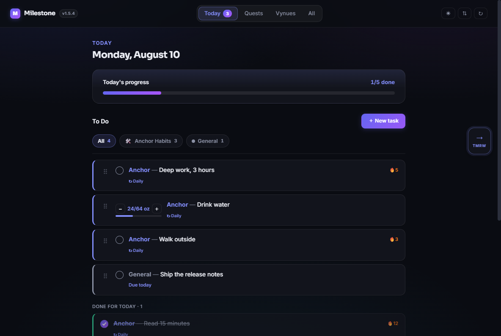
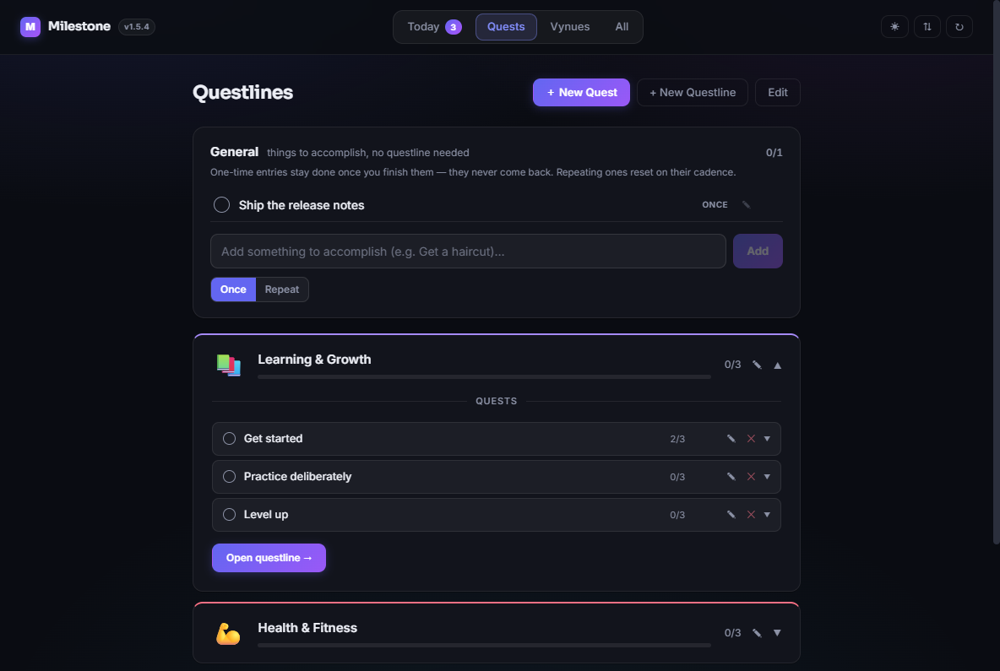

# Milestone

A goal tracker built around one idea: long-term goals only move when something
lands on today's list. Questlines hold the ambition, Today holds the work, and
the same task shows up in both.

Runs as a Windows desktop app (Electron) and as an installable PWA from the same
source — see [Releases](#releases). Both keep themselves up to date.



Long-term structure lives in questlines, and anything due surfaces on Today:



## What's in it

- **Questlines → quests → tasks.** A three-level breakdown, optionally sequential
  so the next quest unlocks only when the previous one is done.
- **Today.** Every due thing in one list, whatever it came from — routines, quest
  tasks, pinned quests, Vynues project tasks — filterable by category and
  reorderable by hand.
- **Recurrence** that goes past "daily/weekly/monthly": custom intervals ("every
  3 weeks") and calendar rules ("first Monday", "last weekday of every 2 months").
- **Counters and checklists.** A task can be "gym 3×/week" or "64 oz of water"
  rather than a checkbox, and any task breaks down into infinitely nestable steps.
- **Streaks, skips and a heatmap.** A skip is a *neutral* day — it protects the
  streak without earning credit, for when a task was genuinely impossible.
- **Consistency, per habit.** The heatmap says whether you were busy on the 14th;
  this says *which* habit you quietly stopped doing, sorted longest-neglected first.
- **Undo.** Every delete is reversible for twelve seconds, and the toast names the
  cascade — deleting a questline takes its quests and linked tasks with it, and
  that should be visible before it matters.
- **Search.** `⌘K` / `Ctrl-K`, or `/`. Questlines, quests, tasks, Vynues and
  nested steps, ranked so the thing you meant is first.
- **A daily reminder.** One nudge, at an hour you pick, only on days with
  something still open. Desktop builds can also sit in the tray with the count.
- **Vynues.** A lighter project/task board for work that isn't goal-shaped.
- **Sync and backup.** Cross-computer sync through any folder your cloud drive
  already syncs; automatic rolling snapshots (on disk in the desktop app,
  IndexedDB in the browser); JSON export/import; optional Notion push/pull.

## Running it

```bash
npm install
npm run dev            # Vite dev server at localhost:5173
npm run electron:dev   # the desktop shell against that dev server
```

Checks:

```bash
npm test               # vitest — recurrence engine, subtree walks, sync clocks
npm run lint
npx tsc -b
```

The tests cover the logic that fails *silently* — calendar rules, the 5am
logical-day rollover, streak transitions across skips, day attribution in the
completion log, vector-clock comparison, what lands on a given day's list, undo's
cascade restores, search ranking, and reminder scheduling. Those are the places
where a bug looks like "I forgot to do it" rather than like a crash.

## Releases

Cutting one is a version bump and a push:

```bash
npm run bump:patch     # or bump:minor / bump:major — never hand-edit the version
git commit -am "…" && git push
```

From that one push, three things happen and every device ends up on the same
build without being touched:

| | what runs | what picks it up |
|---|---|---|
| **Web / phone** | `.github/workflows/pages.yml` | The open app notices within 15 minutes, or the moment it's next foregrounded, and reloads itself (`src/lib/appUpdate.ts`) |
| **Desktop** | `.github/workflows/release.yml` — packages Windows, publishes a GitHub Release | Each install checks every 6 hours, downloads in the background, and swaps it in when you next close the app (`electron/updater.cjs`) |
| **Relay** | `.github/workflows/relay.yml` | Redeployed, so the copy of the app *it* serves stays current too |

The release workflow only fires when `package.json`'s version has no release yet,
so ordinary commits deploy the web app and stop there.

To build locally instead — for a machine with no network, or to test a package
before publishing:

```bash
npm run package        # regenerate icons, build, package to release/
```

The desktop build lands in `release/Milestone-win32-x64/` (gitignored — it's
~290MB of Chromium), and `scripts/install.ps1` copies it to
`%LOCALAPPDATA%\Milestone`. `npm run release:patch|minor|major` does the bump and
the package in one step, without going through CI.

Version lives in `package.json` and nowhere else: `vite.config.ts` reads it into
`__APP_VERSION__`, which surfaces beside the nav-bar brand and in the Data modal —
that's how you tell a fresh build from a stale one. It's also written to
`dist/version.json`, which is how a running phone app finds out that it isn't the
current build any more.

## Keeping the devices in step

Two computers sharing a cloud folder sync through it. A phone can't read that
folder, so it needs one of the other two routes:

- **Over Wi-Fi**, from a desktop that's awake — Sync & Backup → *On your phone*.
- **Through a relay**, for everything else. One small always-on address all three
  devices reach, so an edit made on a train is on the desktop as it happens. See
  **[docs/relay.md](docs/relay.md)** — `fly deploy` and pasting an address into
  each device, or **[docs/relay-oracle.md](docs/relay-oracle.md)** to run the
  same relay for nothing on an always-free VM.

All three routes speak the same protocol and a device uses whichever are up at
once, so the reconciler never has to care which one a change arrived by. Changes
are pushed over an event stream rather than polled for, with a poll underneath as
a backstop.

## Where your data lives

Everything is local. In the desktop app that's Chromium local storage under
`%APPDATA%\Milestone`; in the browser it's the tab's local storage. There is no
account and no server — the sync feature just writes a JSON file into a folder
OneDrive/Dropbox/Drive is already carrying, and each device only ever writes its
own file (see `electron/cloudSync.cjs` and `src/lib/cloudSync.ts`).

Back it up from **Sync & Backup → Download backup**. That same JSON restores via
**Load backup**, and is the format every other recovery path uses too.

### If the data ever disappears

The desktop app keeps rolling snapshots in `%APPDATA%\Milestone\backups\` — one
per launch, deduplicated, fourteen deep. Restore one from **Sync & Backup →
Restore**, which lists each snapshot with the number of questlines and tasks in
it, so a snapshot taken *after* something went wrong is obvious before you use it.

The browser build keeps the same rolling window in IndexedDB, and the card says
so plainly: those copies live in the same origin as the data they protect, so
clearing site data takes both. In a browser, **Download backup** is the one that
actually survives.

If the app itself can't reach the data — a reset profile, or a copy of
`%APPDATA%\Milestone` rescued off another machine — read it straight out of the
Chromium LevelDB:

```bash
npm run recover-profile                 # scans the usual profile locations
npm run recover-profile -- <profile-dir>
```

It only reads, prints what it found in each profile, and writes a bundle to your
home directory for **Load backup**.

## Layout

```
electron/     main process — window, Notion IPC, cloud-folder sync, backups, tray
scripts/      icon generation, and the LevelDB profile recovery tool
src/pages/    Today, Quests, All, Questline detail, Vynues
src/components/  row/drawer/modal UI
src/components/today/  the Today list's row, drag plumbing and furniture
src/lib/      pure helpers — recurrence rules, subtask trees, sync reconciliation,
              day membership, search ranking, undo, reminder scheduling
src/store.ts  quest + routine state (zustand, persisted); the recurrence engine
src/vynuesStore.ts  the Vynues half of the same
*.test.ts     beside the module they cover
```

Notes for anyone reading the code:

- **Undo is one slot, not a stack** (`src/lib/undo.ts`). A stack invites undoing
  something from five minutes ago, by which point the state it was captured
  against has moved on and putting the item back is a guess. Restores splice items
  back at their original index and skip any id that reappeared in the meantime, so
  an undo can never duplicate a live row.
- **Per-task history only counts forward** (`store.taskHistory`). The aggregate
  `completionLog` records how many tasks a day held, never which — so nothing
  already stored can be back-filled, and the Consistency panel says so on an empty
  install rather than implying you've done nothing.

- **The Notion API key is encrypted at rest** via Electron's `safeStorage` (DPAPI
  on Windows). Configs written by older builds are upgraded in place on first read.
- **Sync tracks each store independently.** Quests, Vynues projects and UI
  preferences carry their own vector clocks, so editing quests on one machine and
  Vynues on another isn't a conflict — both sides fast-forward. Only a store
  edited on *both* machines forces a choice, and only that store pays for it.
